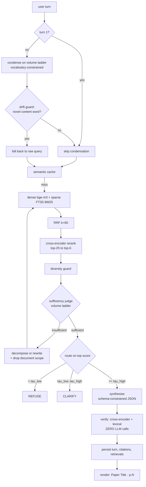

# Cited Research Agent

**A conversational research agent whose every answer sentence carries a machine-verifiable citation to a specific chunk and page — and which refuses, explicitly, when the corpus does not contain the answer.**

> The agent holds a multi-turn conversation about a corpus of research papers. Every answer sentence carries a machine-verifiable citation to a specific chunk and page; when the corpus does not support an answer it refuses explicitly; when the question is ambiguous it asks rather than guesses. Conversation state, citation records, and API quota accounting are persisted in SQLite.

Eleven foundational ML papers. No API key required. No Docker, no vector database, no services.

---

## 1 · What it does

**A cited answer.** Real output, `research-agent ask`:

```
# What rank does LoRA use in its GPT-3 175B experiments, and which weight matrices
  does it adapt?

We set a parameter budget of 18M (roughly 35MB if stored in FP16) on GPT-3 175B,
which corresponds to r = 8 if we adapt one type of attention weights or r = 4 if we
adapt two types.[^1] In the Transformer architecture, there are four weight matrices
in the self-attention module (Wq, Wk, Wv, Wo) and two in the MLP module. We limit our
study to only adapting the attention weights for downstream tasks.[^2]

## Sources

[^1]: LoRA: Low-Rank Adaptation of Large Language Models · pp.10-12 — `p_lora_0007`
[^2]: LoRA: Low-Rank Adaptation of Large Language Models · pp.4-5  — `p_lora_0002`

- Provider: ollama · model: llama3.1:8b · Sentence verification: verified 2
```

**An honest refusal.** The corpus contains no GPT-4 paper:

```
# What was the total dollar cost of training GPT-4?

**The sources do not contain an answer to this question.**

top rerank 0.704 < tau_low 0.736: nothing in the corpus is a strong enough match
to answer from

_No citations are given, because there is nothing in the corpus to cite.
 This is the intended behaviour, not a failure._

- Route: refuse · Top rerank score: 0.7038 · Retrieval loops: 2
```

**A clarifying question** rather than a guess, when the question is under-specified — see §6.

## 2 · Quickstart

Five commands. **The Ollama path needs no API key of any kind.**

```bash
pip install -r requirements.txt && pip install -e .
research-agent doctor --gpu      # verifies CUDA, SQLite FTS5, Ollama
research-agent fetch             # 11 papers from data/manifest.yaml
research-agent ingest && research-agent index
research-agent ask "What rank does LoRA use in its GPT-3 175B experiments, and which weight matrices does it adapt?"
```

Prerequisites: Python 3.11+, [Ollama](https://ollama.com) running with `ollama pull llama3.1:8b`, and a CUDA GPU (CPU works but is roughly 5× slower — set `REQUIRE_CUDA=false` to allow it knowingly).

**Measured timings, not estimates.** First run downloads ~4.6 GB of encoder weights, ~5 GB for the local model, and 11 PDFs at a polite 3-second spacing — budget 20–40 minutes cold, mostly download.

After that, **a single `ask` takes about 45 seconds wall-clock** on the reference machine. Roughly 30 s of that is process start and loading bge-m3 plus the reranker; only ~15 s is the turn itself. The 14.6 s p50 in §8 is that in-process turn latency, measured inside the evaluation loop where the encoders load once and serve every question — it is not what a single command costs. `chat` pays the load once and then answers at the p50 rate.

To skip setup entirely: every result is committed under [`outputs/`](outputs/).

## 3 · How it works



**It decides whether it has enough evidence, acts again when it does not, asks when the question is ambiguous, refuses when the corpus is silent, and checks its own output before returning it — that is what makes it an agent rather than a RAG script.**

The loop is plain Python, not LangGraph, and there is exactly one of it: a single-turn question is just a session with one turn. I have shipped LangGraph in production and chose against it here because this is the logic a reviewer most wants to read, and a framework would hide it behind a graph definition. `research-agent ask --trace` prints the nodes actually visited:

```
[0] retrieve           scope=['lora','qlora'] · 6 hits · top 0.915
[0] sufficiency-judge  (volume) INSUFFICIENT — Comparison of LoRA and QLoRA's memory
[0] rewrite            (volume) → 'How does QLoRA outperform LoRA in reducing memory'
[1] relax-constraints  dropped document scope ['lora','qlora']
[1] retrieve           6 hits · top 0.979
[1] sufficiency-judge  (volume) sufficient
```

## 4 · The citation contract

This is the technical thesis. My previous system's README listed as a known limitation: *"passage-level citations require manual parsing of the synthesiser's inline markers."* This build fixes that.

The model must emit this shape, under constrained decoding on **both** providers:

```json
{
  "insufficient_evidence": false,
  "refusal_reason": null,
  "sentences": [
    {"text": "We set a parameter budget of 18M on GPT-3 175B...", "cite": ["p_lora_0007"]}
  ]
}
```

Each link becomes a row:

```sql
turn_citations(turn_id, sentence_idx, sentence_text, chunk_id, verify_score, status)
```

**Why structured beats inline markers**, concretely — a sentence→chunk mapping is *checkable* (every id is validated against what was actually retrieved), *persistable* (one row per link), and *queryable* (a later turn can resolve "the second source" with SQL). Inline markers are none of the three. `[2]` in prose also tells you nothing about *which sentence* it supports once two markers sit in one paragraph.

Two mechanisms, covering different failures, neither redundant:

- **Constrained decoding fixes the shape.** It cannot fix the truth — a model can emit a well-formed lie.
- **Validation fixes the truth.** Every returned id is checked against the retrieved set; an invented id raises and is *never rendered*. Fatal rather than filtered, because dropping a bad citation silently leaves a partially-correct answer that looks complete.

**Measured: 0 invented citation ids across every run of this project.**

A refusal carries zero citations *by construction* — if `insufficient_evidence` is true, any sentences returned are discarded. That property holds because of how the code is written, not because the model behaved well on the day.

**Source references survive the conversation.** Because every link is a row, a follow-up can point at one by position:

```sql
SELECT chunk_id, MIN(sentence_idx) AS first_seen
FROM turn_citations WHERE turn_id = ?
GROUP BY chunk_id ORDER BY first_seen;   -- "the second source" = row 2
```

Ordinal position is the order footnotes appeared in the rendered answer — the order the user actually saw. When the previous answer had fewer sources than the user asked for, the agent says so rather than retrieving on a contentless phrase. Transcript: [`outputs/conversations/D_source_carry_forward.md`](outputs/conversations/D_source_carry_forward.md).

## 5 · Retrieval approach

Hybrid dense + sparse, fused by rank, reranked by a cross-encoder.

| Config | Recall@5 | 95% CI | MRR | nDCG@10 | p50 ms | LLM calls |
|---|---:|---:|---:|---:|---:|---:|
| Dense only (bge-m3) | 0.479 | [0.21, 0.75] | 0.512 | 0.588 | 29 | 0 |
| Sparse only (FTS5 BM25) | 0.479 | [0.25, 0.73] | 0.621 | 0.552 | 3 | 0 |
| Hybrid, RRF k=60 | 0.583 | [0.29, 0.83] | 0.542 | 0.620 | 13 | 0 |
| **Hybrid + cross-encoder rerank** | **0.646** | [0.42, 0.88] | **0.666** | **0.672** | 378 | 0 |

**Every column here is LLM-free.** That is what makes it reproducible on demand, comparable across providers, and immune to synthesis-model variance.

**The intervals overlap, and I am not going to pretend otherwise.** The answerable set is 8 questions. The *ordering* is trustworthy — it is monotone across all three metrics and it matches the mechanism. The *size* of each gap is not established by this sample. Differences smaller than the interval width are not differences.

**Dense and sparse tie on Recall@5 but differ on MRR** (0.512 vs 0.621). They find *different* chunks — on "What rank does LoRA use for GPT-3?" they agreed on only 1 of their top 6. That disagreement is precisely what fusion exploits.

- **RRF over weighted fusion.** Dense cosine and BM25 live on incomparable scales. Normalising makes the fusion weight corpus-dependent — retune per corpus or it silently degrades. RRF uses only rank position: no normalisation, one stable hyperparameter. It discards score magnitude, which is fine because the cross-encoder re-scores the survivors anyway.
- **FTS5 for sparse.** Real BM25 in the same file *and the same transaction* as the chunk metadata, so the dense and sparse indexes cannot disagree about what the corpus contains. The fixed `k1=1.2/b=0.75` is a real limitation and an irrelevant one — they would never have been tuned on 606 chunks. The cost that actually bites is **tokenisation**: `unicode61` splits `GPT-3` into `gpt` + `3`, so compound identifiers are emitted as quoted phrase queries. All query text is escaped, because an unescaped `"`, `*` or a bare `NEAR` raises `OperationalError` mid-turn.
- **The cross-encoder earns its place on cross-paper confusion.** On *"What batch size did BERT use for pre-training?"*, rank fusion returned **LoRA** chunks at #1 and #3; reranking replaced all three with BERT. That is the adjacent-paper confusion this corpus was chosen to expose. It costs the entire latency budget: 13 ms → 378 ms for +6.3 points of Recall@5.
- **Vectors in a numpy sidecar**, not `sqlite-vec`. That extension needs a loadable binary which is disabled on some Python builds, and an install failure costs far more than a linear scan over 606 chunks ever could. At this size the scan is *exact*; HNSW would be the approximation.

### Measured thresholds

Read off the observed rerank score distribution on this corpus — not carried over from a previous project, because a different corpus gives a different distribution.

| Threshold | Value | Derived from |
|---|---:|---|
| `TAU_LOW` | 0.736 | p05 of the answerable population (n=11) — below this, refuse |
| `TAU_HIGH` | 0.786 | p95 of the control population (n=4) — above this, answer |
| `TAU_VERIFY` | 0.378 | p95 of the per-chunk control distribution (n=100) |

Between the two, the agent asks. The bimodality is real: 50 of 100 chunks retrieved for unanswerable questions score below 0.05.

**I derived these wrong twice, and end-to-end measurement caught it both times:**

| attempt | rule | τ_low | τ_high | route accuracy |
|---|---|---:|---:|---:|
| 1 | band around the sweep peak (`peak±`) | 0.80 | 0.99 | 2/13 |
| 2 | the overlap region, `min(pos)`…`max(neg)` | 0.674 | 0.839 | 6/13 |
| 3 | percentiles | **0.736** | **0.786** | **10/13** |

Attempt 1's margin was arbitrary and pushed half of all answerable questions into "clarify". Attempt 2 keyed the band on *one observation from each population*, which at n=11 and n=4 moves enormously on resampling. **A threshold rule has to be validated against routing behaviour, not against its own histogram.**

## 6 · Conversation design

**Condensation is where multi-turn RAG breaks, and it breaks quietly.** In my previous system the follow-up *"what statuses can it have during approval?"* was condensed into a query containing an invented word — *"workflow"* — which steered retrieval into entirely the wrong chapters. Nothing errored. The answer was fluent and wrong.

Two layers, and the second is the one that matters:

1. The prompt forbids introducing any content word absent from the history or the raw follow-up.
2. **A programmatic drift guard** stems the condensed query's content words and diffs them against `history ∪ raw`. Any novel word discards the condensation and uses the raw query.

A prompt instruction is a request; a diff is an enforcement, and only the diff is testable.

**Measured: condensation drift rate 0/13.**

Other rules: **turn 1 skips condensation entirely** (no history, nothing to condense, no quota spent). History is capped by turn count (6) **and** token budget (~2000), whichever binds first — two caps because they fail differently. Full history stays in SQLite for `/history`.

### Three-way routing

Binary answer/refuse forces a bad choice on an ambiguous question. *"What rank is used?"* over a corpus containing both LoRA and QLoRA is not unanswerable — it is under-specified, and the useful response is to ask which. A clarifying question is generated from the *competing candidates*, one per document, so it names the actual alternatives instead of asking the user to "be more specific". It is stored as a real turn with `route='clarify'`.

Routing reads the **top** score, never an average — averaging across the slate makes retrieving *more* results look *worse*.

**Route confusion matrix, single-turn:**

| expected \ actual | abstain | answer | refuse |
|---|---:|---:|---:|
| **answer** | 2 | 6 | 0 |
| **refuse** | 1 | 0 | 3 |

`refuse` and `abstain` are both correct for a control: different mechanisms — refused on the score, or abstained after synthesis found the evidence unsupportive — with the same correct outcome.

Four scenarios, 13 turns, in [`outputs/conversations/`](outputs/conversations/). Honest per-gate outcome: **C passed** (mid-conversation abstention after two confident turns), **D passed in mechanism**, **A partial** (the pronoun resolved correctly; the cross-paper hop did not), **B failed on turn 1** — *"What rank is used?"* scored 0.188 and was refused rather than clarified. The finding underneath is more useful than the failure: **a vague query and an unanswerable query are indistinguishable to a relevance score.**

## 7 · Persistence

One SQLite file, WAL mode, stdlib `sqlite3`, no daemon.

```sql
documents · pages · chunks · chunks_fts · chunk_order · corpus_state
sessions · turns · turn_citations · turn_retrievals · answer_cache
llm_calls                       -- the load-bearing table
eval_runs · eval_results
```

**The quota ledger is why there is a database at all.** Gemini's RPD is a *daily* limit, but the CLI is a short-lived process. An in-memory limiter resets on every invocation — it enforces nothing, and you burn a 20-request daily cap without ever seeing a warning. Deriving RPM and RPD by windowed counts over durable `llm_calls` rows makes the limiter correct across restarts. Demonstrated:

| | process 1 (drains RPD=3) | process 2 (fresh process) |
|---|---|---|
| **Durable ledger, same DB** | `[model-A, model-A, model-A]` | `[model-B]` ← correctly stepped down |
| **Fresh DB per process** (= in-memory) | `[model-A, model-A, model-A]` | `[model-A]` ← **over an exhausted cap** |

Quota is charged at *attempt* time, not on success — the provider counts a failed request too, and a crash mid-call must not leave usage understated.

**Why SQLite and not Redis or Postgres.** I have shipped Qdrant, Milvus, Chroma, Redis and Postgres in production. All of them are wrong here: a reviewer with ten minutes cannot stand up a service stack, and 30 of the 100 points are "working end-to-end agent". At 606 chunks, in-process search is not an approximation of Qdrant — it is exact.

## 8 · Evaluation

**12 single-turn questions** — 4 single-hop, 3 multi-hop, 3 unanswerable controls, 2 false-premise — plus **4 conversations, 13 turns**.

Every gold label was chosen by reading the *extracted chunk text*, never from recollection of these papers, and records the sentence it was drawn from so a reviewer can check the ground truth by reading [`data/questions.yaml`](data/questions.yaml). Three validations run on every evaluation: the chunk must exist, its `text_sha` must match what it was when labelled, and the corpus fingerprint must match. Any failure is a hard error — a label that silently drifts is worse than no label, because the resulting numbers still look plausible.

| Metric | Value | LLM-dependent |
|---|---:|---|
| Recall@5 (hybrid + rerank) | 0.646 | **no** |
| Measured thresholds | see §5 | **no** |
| **Citation precision** | **0.882** | yes |
| **Abstention accuracy** | **1.000 (4/4)** | yes |
| **Invented citation ids** | **0** | yes |
| **Refusals carrying citations** | **0** | yes |
| Fact coverage (mean) | 0.660 | yes |
| Route accuracy — single-turn | 0.917 (11/12) | yes |
| Route accuracy — conversational | 10/13 | yes |
| **Condensation drift rate** | **0/13** | yes |
| Papers cited per multi-hop answer | 1.00 | yes |
| p50 / p95 latency | 14.6 s / 18.6 s | yes |

**Reproducible.** Generation runs greedily with a fixed seed and one discarded warm-up call — measured on this machine, the *first* call after a model load returns different text from every subsequent identical call, which then agree 6/6. Two full runs with the cache cleared produce **identical reports apart from wall-clock latency.**

The strongest results are the structural ones: zero invented ids and zero refusals-with-citations hold because `answer.py` enforces them.

Full report, both tables, per-question rows, histograms and a traceability table mapping every number above to its source: [`outputs/eval_report.md`](outputs/eval_report.md).

### Groundedness verification, with zero LLM calls

Each answer sentence is scored against each chunk it cites, using the cross-encoder already loaded. Free, deterministic, repeatable, quota-neutral — which is what makes it affordable on *every* turn.

The verifier sees **byte-identical text** to the synthesiser. In my previous system the validator got 500-character truncations while the synthesiser got full chunks plus parents, producing false unsupported-claim flags on correctly-sourced figures. Here the context is built once and both stages read the same objects; a test asserts it rather than a comment claiming it.

**Cross-encoder relevance alone was not good enough, and the measurement is why.** A sentence lifted **verbatim** from its cited passage scored **0.3438**, while a passage that did *not* contain it scored **0.6218**. The cross-encoder scores topical relevance between a *query* and a *document*; "does this long passage contain this short statement" is a different question and it answers it badly. Groundedness therefore also uses deterministic **lexical containment**, and a sentence passes on either signal.

## 9 · Design decisions and tradeoffs

63 entries in [`decisions.md`](decisions.md), each written when the decision was made rather than reconstructed afterwards, each with an Options / Why / Consequence / Evidence / Revisit-if structure. The most load-bearing:

| | |
|---|---|
| **No vector DB, no services** | At 606 chunks exact search beats the reviewer's time cost of standing up Qdrant. HNSW would be the approximation. |
| **SQLite as the persistence layer** | A daily rate limit cannot be enforced from a process that exits between requests. |
| **Structured citations** | Checkable, storable, queryable. Inline markers are none of the three. |
| **Plain state machine over LangGraph** | I must defend every line in interview; a framework would hide the logic reviewers want to read. |
| **Cross-encoder verification, no LLM judge** | Free, deterministic, repeatable across runs, quota-neutral. |
| **Measured thresholds** | Derived from this corpus's distribution; the code refuses to route until they are measured. |

Several entries record things that **went wrong and were caught by measuring**, which is most of what the log is for — a double sigmoid that compressed `[0, 1]` into `[0.5, 0.73]` and would have made every threshold meaningless; a corpus fingerprint that hashed PDF bytes and so never noticed the parser changing; a semantic cache that stored answers correctly and discarded them on retrieval; Ollama silently truncating a 7,000-token prompt to 4,096 while every downstream check still passed.

**Not used, despite production experience with all of them:** Qdrant, Milvus, Chroma, FAISS, Redis, Postgres, Docker, FastAPI, LangGraph.

### Permanently out of scope

Stated deliberately — silent omission reads as a gap.

- **OCR of scanned PDFs.** Not now, not as an extension. A document that does not extract as text gets replaced.
- Docker, Postgres, Redis, Qdrant, Milvus, Chroma, FastAPI, auth, message queues.
- Any hosted deployment or public endpoint.
- Fine-tuning or training of any model.

## 10 · Free-tier quota engineering

Two ladders, split by **purpose** rather than capability alone, because a conversational turn costs roughly one synthesis call plus two to four volume calls.

- **Synthesis ladder** — capability-ordered, ~20 RPD per model.
- **Volume ladder** — capacity-ordered, ~500 RPD. Serves condensation, sufficiency judging, rewriting, decomposition, clarification.

Routing volume work through synthesis models exhausts reasoning quota in about four turns, and the failure lands on answer generation — the one thing a reviewer sees. Separating them means **answer quality degrades last**. Verified from the ledger: every non-synthesis call sits on the volume ladder, zero misrouted.

⚠️ **`gemini-2.5-flash-lite` is a trap.** Named like a volume model, capped at **20 RPD**, not 500. On the volume ladder it exhausts silently after twenty condensation calls and cascades failures into the agent path. It sits at the **bottom of the synthesis ladder**, `Config.validate()` raises if anyone moves it, and three tests cover the placement.

Other measures: a DB-backed sliding-window limiter per `(model, key_alias)`; **non-blocking** `try_acquire()` so a saturated key never blocks a free one; multi-key rotation draining each key on a rung before stepping down; a `sha256(model+prompt+params)` disk cache; a semantic answer cache on the condensed-query embedding. Exhaustion raises a typed error naming the rung, never a stack trace. `research-agent budget` prints remaining RPM/RPD per model per key.

**Free-tier quota is per project, not per key** — three keys from one Google Cloud project share one bucket and rotation buys nothing.

## 11 · Hardware notes

Developed on an RTX 5070 Ti Laptop (12 GB), 32 GB RAM, Windows.

| Component | Precision | Measured VRAM |
|---|---|---:|
| bge-m3 | fp16 | 1.06 GB |
| bge-reranker-v2-m3 | fp16 | 1.06 GB |
| **Both encoders** | | **2.16 GB** |
| llama3.1:8b Q4_K_M | | 5.46 GB |

**`pip install torch` gives you a CPU build and says nothing.** It reports success, `torch.cuda.is_available()` returns `False`, and every encoder runs ~5× slower with no error anywhere. If a CPU wheel is already installed, `pip install torch` prints *"already satisfied"* and leaves it. RTX 50-series is compute capability **sm_120** and needs CUDA 12.8+, so cu126 wheels load but carry no kernels for it. This project pins the **cu130** build and `doctor --gpu` hard-fails rather than letting a CPU fallback pass silently — it launches a real fp16 matmul, because a device query alone does not prove the build carries kernels for your architecture.

```bash
pip install --force-reinstall --no-deps torch==2.12.1+cu130 \
    --index-url https://download.pytorch.org/whl/cu130
```

**Ollama has the same class of silent failure, and it is worse than slow.** With the encoders holding 2.16 GB, Ollama's scheduler evicts and reloads the 5.46 GB model between calls: an identical short call took **1.5 s standalone and 71.4 s in-process**. That is not inference, it is disk I/O. `keep_alive` fixes it. Separately, Ollama's default context window is **4096 tokens** and it truncates silently above it — a ~7,000-token prompt came back reporting `prompt_eval_count = 4096`, and the model then wrote fluent, correctly-cited output from less than half the evidence while every check passed. `num_ctx` is set explicitly and the reported token count is compared against the window on every call.

## 12 · Limitations and known failure cases

Specific and honest. This list grows as measurement finds things; it does not shrink.

- **No OCR, ever.** Born-digital arXiv PDFs only. A document that does not extract as text gets replaced.
- **Equations, figures and multi-page tables extract poorly.** Visible in the ingest gate dump. A table rendered as `Batch Size 32 16 1` is not useful evidence, and no parser tuning makes it so.
- **Multi-hop is not solved.** 1.00 papers cited per multi-hop answer. The diversity guard *does* get a second paper into the context slate — the synthesiser then answers from one. The failure is in synthesis, not retrieval. One run produced a genuine two-paper answer; it did not reproduce.
- **A false-premise question that names the wrong paper defeats retrieval by construction.** `q11` scores **0.00 Recall@5 on every configuration**: the query says "the LoRA paper", so both retrievers go to LoRA, and the QLoRA passage that would correct the premise never arrives. No prompt can correct a premise from evidence it never received.
- **Groundedness verification proves a sentence came from its cited passage; it cannot prove the passage answers the question.** A right-topic wrong-paper answer passes every automated check. Measured directly: the agent once produced a correctly-cited, verifiably-grounded, completely wrong answer.
- **Verification is a relevance proxy plus lexical overlap, not trained NLI**, and it shares a model family with the reranker, so verifier and retriever are correlated by construction.
- **Thresholds are tuned on the same questions the routing is scored against, not held out**, so route accuracy is optimistic by construction. The control population is **four questions** — that cannot support a p95, and `TAU_HIGH` is the least well-evidenced number in the system.
- **Small evaluation set.** 8 answerable questions; every mean carries a bootstrap interval and they overlap.
- **The sufficiency judge currently rejects the first retrieval on every question**, making the loop an unconditional second pass — correct in outcome, ~3× the latency.
- **`GeminiProvider` has never made a real API call.** Its signature is written to the documented API and is unverified; every number in this README is from Ollama.
- Flat vector scan: fine to ~10k chunks. English only. Single-user, single-process.

## 13 · With more time

In the order I would actually do them:

1. **More control questions.** The single highest-value change — `TAU_HIGH` rests on four.
2. **A held-out calibration set**, so route accuracy stops being optimistic by construction.
3. **Fix multi-hop in synthesis**, where it actually fails, and measure whether the cross-document rule holds up across runs.
4. **A trained NLI verifier** instead of a relevance proxy.
5. Span-level offsets within a chunk; table-aware extraction; Qdrant + HNSW at corpus scale; multi-user sessions.

## 14 · Optional extensions

Both are additive. Neither is required, neither is installed by the quickstart, and
the headline numbers above are corpus-only CLI results.

**Streamlit chat UI** — a read-only view over the same agent. It imports
`agent.run_turn` and renders the result; no business logic lives in it.

```bash
pip install -r requirements-ui.txt
research-agent ui
```

Shows the cited answer, every cited passage expandable with its groundedness score,
and a "How this turn was decided" panel with the condensation, drift check, route and
full loop trace.

**Live web search** — `--web`, **off by default**.

```bash
research-agent ask --web "What is NF4 quantisation?"
```

Web results are *appended* to the corpus candidates and compete on the same reranker
score. They go through the identical chunk → cite → verify path, and render as
`[web] Title — url` with a `web_` id prefix, never with an invented page number.

**With the flag off, behaviour is unchanged: 4/4 controls abstain with identical
routes, and a test asserts the corpus-only path makes no network call at all.** The
provider is DuckDuckGo's HTML endpoint, so the extension needs no API key either.

## 15 · Sample inputs and outputs

Committed so results are readable without running anything.

- [`outputs/answers/`](outputs/answers/) — all 12 questions, `.md` + `.json`, including the four refusals
- [`outputs/conversations/`](outputs/conversations/) — 4 full transcripts with condensation, drift checks and routes per turn
- [`outputs/eval_report.md`](outputs/eval_report.md) — every measured number, with traceability
- [`data/questions.yaml`](data/questions.yaml) · [`data/conversations.yaml`](data/conversations.yaml) — the question sets with gold labels and their source quotes

## Troubleshooting

| Symptom | Cause | Fix |
|---|---|---|
| `doctor --gpu` fails on CUDA | CPU-only torch wheel | the `--force-reinstall` line in §11 |
| Everything runs but ~5× slow | same, undetected | `REQUIRE_CUDA=true` (default) makes it loud |
| `ContextTruncated` | prompt exceeded `num_ctx` | raise `OLLAMA_NUM_CTX` or lower `CONTEXT_TOP_N` |
| A short call takes 30 s+ | Ollama evicting the model | ensure `OLLAMA_KEEP_ALIVE` is set |
| `model not found` | model not pulled | `ollama pull llama3.1:8b` |
| `index is stale` | corpus or chunk config changed | `research-agent ingest && research-agent index` |
| Gold label validation fails | chunk text moved since labelling | re-validate with `research-agent labels --show` |
| Quota exhausted | Gemini rung drained | `research-agent budget`; the Ollama path is unlimited |
| `OSError` / `No such file` installing torch on Windows | **MAX_PATH.** Torch ships headers nested past 260 characters | clone to a short path (`C:\dev\...`), or enable long paths: `git config --system core.longpaths true` and the `LongPathsEnabled` registry key |

`research-agent doctor` checks all of this in one command.
