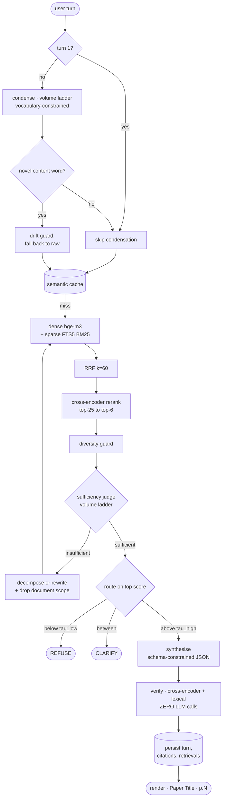

# Cited Research Agent

> **Every answer sentence carries a machine-verifiable citation to a specific chunk and page. When the corpus cannot answer, it says so.**

A conversational research agent over 11 foundational ML papers. Citations are a
structured contract the model must emit — validated, persisted relationally, and
verified without spending a token. Runs on a local model with **no API key at all**.

<sub>Python 3.11+ · SQLite · bge-m3 + bge-reranker-v2-m3 · Ollama or Gemini · no Docker, no vector database, no services</sub>

---

## At a glance

| | |
|---|---|
| **Invented citations, across every run** | **0** — structurally impossible, not luck |
| **Abstention accuracy** | **4/4** on unanswerable controls |
| **Citation precision** | 0.882 local · **0.952–1.000** Gemini (2 runs) |
| **Condensation drift rate** | **0/13** — the target was 0 |
| **Rate-limit rejections, run 1 (607 billed calls)** | **0** |
| **Daily answer capacity, 4 keys** | 4,480 API calls, then an **unlimited local floor** |
| Recall@5 — hybrid + rerank *(LLM-free)* | **0.646**, up from 0.479 single-retriever |
| Tests | 164, no network, no model downloads |
| Design decisions logged | 78, each with evidence |

**What is deliberately *not* claimed:** multi-hop synthesis. Measured at 1.00 papers
per multi-hop answer on **both** providers — see [§12](#12--limitations).

---

## Contents

| | | | |
|---|---|---|---|
| [1 · What it does](#1--what-it-does) | [5 · Retrieval](#5--retrieval) | [9 · Quota engineering](#9--quota-engineering) | [13 · With more time](#13--with-more-time) |
| [2 · Quickstart](#2--quickstart) | [6 · Conversation](#6--conversation) | [10 · Design decisions](#10--design-decisions) | [14 · Extensions](#14--optional-extensions) |
| [3 · How it works](#3--how-it-works) | [7 · Persistence](#7--persistence) | [11 · Hardware](#11--hardware) | [15 · Outputs](#15--sample-outputs) |
| [4 · Citation contract](#4--the-citation-contract) | [8 · Evaluation](#8--evaluation) | [12 · Limitations](#12--limitations) | [Troubleshooting](#troubleshooting) |

---

## 1 · What it does

Three behaviours, all real output.

**Answers, with citations**

```
Q: What rank does LoRA use in its GPT-3 175B experiments, and which
   weight matrices does it adapt?

We set a parameter budget of 18M (roughly 35MB if stored in FP16) on
GPT-3 175B, which corresponds to r = 8 if we adapt one type of attention
weights or r = 4 if we adapt two types.[^1] In the Transformer
architecture, there are four weight matrices in the self-attention
module (Wq, Wk, Wv, Wo) and two in the MLP module.[^2]

  [^1]: LoRA: Low-Rank Adaptation of Large Language Models · pp.10-12
  [^2]: LoRA: Low-Rank Adaptation of Large Language Models · pp.4-5

  Sentence verification: verified 2
```

**Refuses, when the corpus is silent**

```
Q: What was the total dollar cost of training GPT-4?

The sources do not contain an answer to this question.
top rerank 0.704 < tau_low 0.736

No citations are given, because there is nothing in the corpus to cite.
This is the intended behaviour, not a failure.
```

**Corrects a false premise, rather than playing along or refusing**

```
Q: Which section of the LoRA paper describes its 4-bit NF4
   quantisation scheme?

The premise of the question is incorrect: the 4-bit NormalFloat (NF4)
quantisation scheme is not introduced or described by the LoRA
paper.[^1] Instead, NF4 is introduced by the QLoRA paper as an
innovation to save memory without sacrificing performance.[^1]

  [^1]: QLoRA: Efficient Finetuning of Quantized LLMs · pp.1-2
```

And when a question is genuinely under-specified it **asks** rather than guessing —
naming the competing sources, not saying "please be more specific".

---

## 2 · Quickstart

**Five commands. No API key of any kind.**

```bash
pip install -r requirements.txt && pip install -e .
research-agent doctor --gpu      # CUDA, SQLite FTS5, Ollama, ladder validity
research-agent fetch             # 11 papers from data/manifest.yaml
research-agent ingest && research-agent index
research-agent ask "What rank does LoRA use in its GPT-3 175B experiments, and which weight matrices does it adapt?"
```

**Prerequisites** — Python 3.11+, [Ollama](https://ollama.com) with
`ollama pull llama3.1:8b`, and a CUDA GPU (CPU works, roughly 5× slower; set
`REQUIRE_CUDA=false` to allow it knowingly).

<details>
<summary><b>Measured timings — not estimates</b></summary>

<br>

| | |
|---|---:|
| First run (encoder + model downloads, 11 PDFs at 3 s spacing) | 20–40 min |
| A single `research-agent ask`, warm | **~45 s** |
| ↳ of which process start + loading both encoders | ~30 s |
| ↳ of which the turn itself | ~15 s |

The 14.6 s p50 in [§8](#8--evaluation) is *in-process turn* latency, measured inside
the evaluation loop where the encoders load once and serve every question. It is not
what a single command costs. `chat` pays the load once, then answers at the p50 rate.

</details>

To skip setup entirely, every result is committed under [`outputs/`](outputs/).

---

## 3 · How it works



> **It decides whether it has enough evidence, acts again when it does not, asks when
> the question is ambiguous, refuses when the corpus is silent, and checks its own
> output before returning it — that is what makes it an agent rather than a RAG script.**

The loop is plain Python, not LangGraph, and there is **exactly one of it**: a
single-turn question is a session with one turn. I have shipped LangGraph in
production and chose against it here because this is the logic a reviewer most wants
to read, and a framework would hide it behind a graph definition.

`research-agent ask --trace` prints the nodes actually visited:

```
[0] retrieve           scope=['lora','qlora'] · 6 hits · top 0.915
[0] sufficiency-judge  (volume) INSUFFICIENT — Comparison of LoRA and QLoRA's memory
[0] rewrite            (volume) -> 'How does QLoRA outperform LoRA in reducing memory'
[1] relax-constraints  dropped document scope ['lora','qlora']
[1] retrieve           6 hits · top 0.979
[1] sufficiency-judge  (volume) sufficient
```

---

## 4 · The citation contract

**This is the technical thesis.** My previous system's README listed as a known
limitation: *"passage-level citations require manual parsing of the synthesiser's
inline markers."* This build fixes that.

The model must emit this shape, under constrained decoding on **both** providers:

```json
{
  "insufficient_evidence": false,
  "refusal_reason": "",
  "sentences": [
    {"text": "We set a parameter budget of 18M on GPT-3 175B...",
     "cite": ["p_lora_0007"]}
  ]
}
```

Each link becomes a row:

```sql
turn_citations(turn_id, sentence_idx, sentence_text, chunk_id, verify_score, status)
```

### Why structured beats inline markers

| | inline `[2]` | structured mapping |
|---|:---:|:---:|
| Can you check the id is real? | no | **yes** — validated against what was retrieved |
| Can you store one link per row? | no | **yes** — `turn_citations` |
| Can a later turn query it? | no | **yes** — "the second source" resolves in SQL |
| Which *sentence* does it support? | ambiguous once two markers share a paragraph | **explicit** |

**Two mechanisms, covering different failures, neither redundant:**

- **Constrained decoding fixes the shape.** It cannot fix the truth — a model can emit
  a perfectly well-formed lie.
- **Validation fixes the truth.** Every returned id is checked against the retrieved
  set; an invented id **raises and is never rendered**. Fatal rather than filtered,
  because silently dropping a bad citation leaves a partially-correct answer that
  looks complete.

A refusal carries zero citations **by construction** — if `insufficient_evidence` is
true, any sentences returned are discarded. That property holds because of how the
code is written, not because the model behaved well on the day.

### Source references survive the conversation

```sql
SELECT chunk_id, MIN(sentence_idx) AS first_seen
FROM turn_citations WHERE turn_id = ?
GROUP BY chunk_id ORDER BY first_seen;   -- "the second source" = row 2
```

Ordinal position is the order footnotes appeared in the rendered answer — the order
the user actually saw. When the previous answer had fewer sources than the user asked
for, the agent says so rather than retrieving on a contentless phrase. Transcript:
[`D_source_carry_forward.md`](outputs/conversations/D_source_carry_forward.md).

### Groundedness verification, with zero LLM calls

Each sentence is scored against each chunk it cites, using the cross-encoder already
loaded. Free, deterministic, repeatable, quota-neutral — which is what makes it
affordable on *every* turn rather than only when someone remembers.

The verifier sees **byte-identical text** to the synthesiser. In my previous system
the validator got 500-character truncations while the synthesiser got full chunks plus
parents, producing false unsupported-claim flags on correctly-sourced figures. Here
the context is built once and both stages read the same objects — **asserted by test**,
not claimed in a comment.

> **Cross-encoder relevance alone was not good enough, and measurement is why.** A
> sentence lifted **verbatim** from its cited passage scored **0.3438**, while a
> passage that did *not* contain it scored **0.6218**. The cross-encoder scores
> topical relevance between a *query* and a *document*; "does this long passage
> contain this short statement" is a different question, and it answers it badly.
> Groundedness therefore also uses deterministic **lexical containment**, and a
> sentence passes on either signal.

---

## 5 · Retrieval

Hybrid dense + sparse, fused by rank, reranked by a cross-encoder. **Every number in
this section is LLM-free** — reproducible on demand, comparable across providers, and
immune to synthesis-model variance.

| Config | Recall@5 | 95% CI | MRR | nDCG@10 | p50 ms |
|---|---:|:---:|---:|---:|---:|
| Dense only (bge-m3) | 0.479 | [0.21, 0.75] | 0.512 | 0.588 | 29 |
| Sparse only (FTS5 BM25) | 0.479 | [0.25, 0.73] | 0.621 | 0.552 | 3 |
| Hybrid, RRF k=60 | 0.583 | [0.29, 0.83] | 0.542 | 0.620 | 13 |
| **Hybrid + cross-encoder rerank** | **0.646** | [0.42, 0.88] | **0.666** | **0.672** | 378 |

> **The intervals overlap, and I am not going to pretend otherwise.** The answerable
> set is 8 questions. The *ordering* is trustworthy — monotone across all three
> metrics and consistent with the mechanism. The *size* of each gap is not established
> by this sample. Differences smaller than the interval width are not differences.

**Dense and sparse tie on Recall@5 but differ on MRR** (0.512 vs 0.621). They find
*different* chunks — on "What rank does LoRA use for GPT-3?" they agreed on only 1 of
their top 6. That disagreement is precisely what fusion exploits.

<details>
<summary><b>Why each component is there</b></summary>

<br>

- **RRF over weighted fusion.** Dense cosine and BM25 live on incomparable scales.
  Normalising makes the fusion weight corpus-dependent — retune per corpus or it
  silently degrades. RRF uses only rank position: no normalisation, one stable
  hyperparameter. It discards score magnitude, which is fine because the cross-encoder
  re-scores the survivors anyway.
- **FTS5 for sparse.** Real BM25 in the same file *and the same transaction* as the
  chunk metadata, so the two indexes cannot disagree about what the corpus contains.
  The fixed `k1=1.2/b=0.75` is a real limitation and an irrelevant one — they would
  never have been tuned on 606 chunks. The cost that actually bites is
  **tokenisation**: `unicode61` splits `GPT-3` into `gpt` + `3`, so compound
  identifiers are emitted as quoted phrase queries. All query text is escaped, because
  an unescaped `"`, `*` or a bare `NEAR` raises `OperationalError` mid-turn.
- **The cross-encoder earns its place on cross-paper confusion.** On *"What batch size
  did BERT use for pre-training?"*, rank fusion returned **LoRA** chunks at #1 and #3;
  reranking replaced all three with BERT. It costs the entire latency budget —
  13 ms to 378 ms for +6.3 points of Recall@5.
- **Vectors in a numpy sidecar**, not `sqlite-vec`, whose loadable extension is
  disabled on some Python builds. An install failure costs far more than a linear scan
  over 606 chunks. At this size the scan is *exact*; HNSW would be the approximation.

</details>

### Measured thresholds

| Threshold | Value | Derived from |
|---|---:|---|
| `TAU_LOW` | 0.736 | p05 of the answerable population (n=11) — below this, refuse |
| `TAU_HIGH` | 0.786 | p95 of the control population (n=4) — above this, answer |
| `TAU_VERIFY` | 0.378 | p95 of the per-chunk control distribution (n=100) |

Between the two, the agent asks. The bimodality is real: 50 of 100 chunks retrieved
for unanswerable questions score below 0.05.

> **I derived these wrong twice, and end-to-end measurement caught it both times.**
>
> | attempt | rule | τ_low | τ_high | route accuracy |
> |---|---|---:|---:|---:|
> | 1 | band around the sweep peak | 0.80 | 0.99 | 2/13 |
> | 2 | overlap region, `min(pos)`…`max(neg)` | 0.674 | 0.839 | 6/13 |
> | 3 | percentiles | **0.736** | **0.786** | **10/13** |
>
> Attempt 1's margin was arbitrary and pushed half of all answerable questions into
> "clarify". Attempt 2 keyed the band on *one observation from each population*, which
> at n=11 and n=4 moves enormously on resampling. **A threshold rule has to be
> validated against routing behaviour, not against its own histogram.**

---

## 6 · Conversation

**Condensation is where multi-turn RAG breaks, and it breaks quietly.** In my previous
system the follow-up *"what statuses can it have during approval?"* was condensed into
a query containing an invented word — *"workflow"* — which steered retrieval into
entirely the wrong chapters. Nothing errored. The answer was fluent and wrong.

Two layers, and **the second is the one that matters**:

1. The prompt forbids introducing any content word absent from the history or the raw
   follow-up.
2. **A programmatic drift guard** stems the condensed query's content words and diffs
   them against `history ∪ raw`. Any novel word discards the condensation and uses the
   raw query.

A prompt instruction is a request; a diff is an enforcement, and only the diff is
testable. **Measured: drift rate 0/13.**

Other rules: **turn 1 skips condensation entirely** — no history, nothing to condense,
no quota spent. History is capped by turn count (6) **and** token budget (~2000),
whichever binds first: two caps because they fail differently. Full history stays in
SQLite for `/history`.

### Three-way routing

Binary answer/refuse forces a bad choice on an ambiguous question. *"What rank is
used?"* over a corpus containing both LoRA and QLoRA is not unanswerable — it is
**under-specified**, and the useful response is to ask which. The clarifying question
is generated from the *competing candidates*, one per document, so it names the actual
alternatives.

Routing reads the **top** score, never an average — averaging across the slate makes
retrieving *more* results look *worse*.

**Route confusion matrix, single-turn (local model):**

| expected ↓ / actual → | abstain | answer | refuse |
|---|:---:|:---:|:---:|
| **answer** | 2 | 6 | 0 |
| **refuse** | 1 | 0 | 3 |

`refuse` and `abstain` are both correct for a control: different mechanisms — refused
on the score, or abstained after synthesis found the evidence unsupportive — with the
same correct outcome.

<details>
<summary><b>Four scenarios, 13 turns — honest per-gate outcome</b></summary>

<br>

| Gate | Outcome |
|---|---|
| **C** — abstain mid-conversation after two confident turns | **passed** |
| **D** — ordinal source reference resolves via `turn_citations` | **passed in mechanism** |
| **A** — resolve "the quantised version" without the user saying QLoRA | **partial** — the pronoun resolved; the cross-paper hop did not |
| **B** — clarify then resolve | **failed on turn 1** |

B is the interesting failure. *"What rank is used?"* scored 0.188 and was refused
rather than clarified. The finding underneath is more useful than the failure:
**a vague query and an unanswerable query are indistinguishable to a relevance score.**

Transcripts: [`outputs/conversations/`](outputs/conversations/).

</details>

---

## 7 · Persistence

One SQLite file. WAL mode, stdlib `sqlite3`, no daemon.

```
documents · pages · chunks · chunks_fts · chunk_order · corpus_state
sessions · turns · turn_citations · turn_retrievals · answer_cache
llm_calls                       <- the load-bearing table
eval_runs · eval_results
```

**The quota ledger is why there is a database at all.** Gemini's RPD is a *daily*
limit, but the CLI is a short-lived process. An in-memory limiter resets on every
invocation — it enforces nothing, and you burn a 20-request daily cap without ever
seeing a warning. Deriving RPM and RPD by windowed counts over durable `llm_calls`
rows makes the limiter correct across restarts.

**Demonstrated with two real processes:**

| | process 1 (drains RPD=3) | process 2 (fresh process) |
|---|---|---|
| Durable ledger, same DB | `[model-A, model-A, model-A]` | `[model-B]` — correctly stepped down |
| Fresh DB per process *(= in-memory)* | `[model-A, model-A, model-A]` | `[model-A]` — **over an exhausted cap** |

Quota is charged at *attempt* time, not on success — the provider counts a failed
request too, and a crash mid-call must not leave usage understated.

**Why SQLite and not Redis or Postgres.** I have shipped Qdrant, Milvus, Chroma, Redis
and Postgres in production. All are wrong here: a reviewer with ten minutes cannot
stand up a service stack, and 30 of the 100 points are "working end-to-end agent". At
606 chunks, in-process search is not an approximation of Qdrant — it is exact.

---

## 8 · Evaluation

**12 single-turn questions** — 4 single-hop, 3 multi-hop, 3 unanswerable controls,
2 false-premise — plus **4 conversations, 13 turns**.

Every gold label was chosen by reading the *extracted chunk text*, never from
recollection of these papers, and records the sentence it was drawn from so a reviewer
can check the ground truth by reading [`data/questions.yaml`](data/questions.yaml).
Three validations run on every evaluation: the chunk must exist, its `text_sha` must
match what it was when labelled, and the corpus fingerprint must match. **Any failure
is a hard error** — a label that silently drifts is worse than no label, because the
resulting numbers still look plausible.

| Metric | Local `llama3.1:8b` | LLM-dependent |
|---|---:|:---:|
| Recall@5 (hybrid + rerank) | 0.646 | **no** |
| Measured thresholds | [§5](#measured-thresholds) | **no** |
| Citation precision | 0.882 | yes |
| **Abstention accuracy** | **1.000 (4/4)** | yes |
| **Invented citation ids** | **0** | yes |
| **Refusals carrying citations** | **0** | yes |
| Fact coverage (mean) | 0.660 | yes |
| Route accuracy — single-turn | 0.917 (11/12) | yes |
| Route accuracy — conversational | 10/13 | yes |
| **Condensation drift rate** | **0/13** | yes |
| Papers per multi-hop answer | 1.00 | yes |
| p50 / p95 turn latency | 14.6 s / 18.6 s | yes |

**Reproducible.** Generation runs greedily with a fixed seed and one discarded warm-up
call — measured on this machine, the *first* call after a model load returns different
text from every subsequent identical call, which then agree 6/6. **Two full runs with
the cache cleared produce identical reports apart from wall-clock latency.**

Full report with per-question rows, histograms and a traceability table mapping every
number to its source: [`outputs/eval_report.md`](outputs/eval_report.md).

### Provider comparison

Identical corpus, thresholds and retrieval; only the generator changed.

Gemini was run **three times**, independently, so the spread is visible rather than a
single observation presented as a point estimate.

| Metric | Local | Gemini ×3 |
|---|---:|---:|
| Route accuracy, single-turn | 0.917 | **1.000 · 1.000 · 1.000** |
| Citation precision | 0.882 | **1.000 · 0.952 · 1.000** |
| Fact coverage | 0.660 | **0.881 · 0.850 · 0.881** |
| Abstention accuracy | 1.000 | 1.000 · 1.000 · 1.000 |
| Invented citations | 0 | 0 · 0 · 0 |
| Condensation drift | 0/13 | 0/13 · 0/13 · 0/13 |
| Papers per multi-hop answer | 1.00 | 1.00 · 1.00 · 1.00 |
| Route accuracy, conversational | **10/13** | 7/13 · 8/13 · 7/13 |
| Recall@5 *(LLM-free)* | 0.646 | 0.646 · 0.646 · 0.646 |

**Single-turn route accuracy of 1.000 reproduced all three times**, as did 4/4
abstention, zero invented citations and zero drift. Gemini wins every single-turn
metric and loses the conversational one — consistently enough, across three runs, that
neither result is noise.

The retrieval row is identical **by construction** — which is exactly why it is
measured separately. Only generation columns move with the model.

**Gemini closes the last single-turn route failure**, the false-premise question shown
in [§1](#1--what-it-does).

**Gemini does not fix multi-hop:** 1.00 papers per answer on both. A stronger model,
given the cross-document rule and passages from two papers in its context, still
answers from one. That **rules out model capability** as the explanation and points at
context construction.

> **Gemini scores lower conversationally, and I was wrong about why — twice.** First
> I blamed provider load; a third run in better conditions refuted that. Then I blamed
> condensation quality. Instrumenting the query retrieval *actually ran on* — not just
> the condensation — showed the real mechanism.
>
> The turns where **both** providers fired **zero** retrieval loops score identically,
> as they must, since retrieval is a local encoder over a local index:
>
> | turn | Ollama | Gemini |
> |---|---:|---:|
> | D t1 | 0.9891 | 0.9891 |
> | D t2 | 0.000 | 0.000 |
> | D t3 | 0.8404 | 0.8336 |
>
> Every divergence tracks the **loop count** instead — Ollama fired 15, Gemini 10:
>
> | turn | ollama loops / top | gemini loops / top | routes |
> |---|---|---|---|
> | A t1 | 1 / 0.9857 | 0 / 0.6837 | answer / **refuse** |
> | B t1 | 2 / 0.9661 | 0 / 0.188 | answer / **refuse** |
>
> A t1 is the cleanest case: turn 1 skips condensation, so both retrieve on the
> byte-identical question. Ollama's judge called it *insufficient*, the loop rewrote
> the query, and the score rose to 0.9857. Gemini's judge called the same evidence
> *sufficient*, no rewrite happened, and the router refused the raw query on 0.6837.
>
> **The finding is architectural, not about either model.** The judge and the router
> are two gates asking overlapping questions, and the judge runs first. A judge that
> accepts early **denies the router a better query**. Ollama's judge is over-eager —
> recorded elsewhere as pure latency cost — and here that is accidentally load-bearing;
> Gemini's is better calibrated and the pipeline is worse for it. The fix is to let the
> router see the best score across iterations, or to invert the gate order — not to
> tune a judge against a 13-turn set.
>
> `research-agent condensation-diff` prints the rewrites side by side.

---

## 9 · Quota engineering

Two ladders, split by **purpose** rather than capability alone, because a
conversational turn costs roughly one synthesis call plus two to four volume calls.

| Ladder | Ordered by | Serves | Models |
|---|---|---|---|
| **Synthesis** | capability | answer generation | `3.7-flash` → `3.6` → `3.5` → `3-flash-preview` → `2.5-flash` |
| **Volume** | daily capacity | condensation, judging, rewriting, decomposition, clarification | `3.5-flash-lite` → `3.1-flash-lite` → `2.5-flash-lite` → **`qwen2.5:14b` (local)** |

| model | RPM | TPM | RPD |
|---|---:|---:|---:|
| `gemini-3.7 / 3.6 / 3.5 / 3-preview / 2.5-flash` | 5 | 250K | 20 |
| `gemini-3.5-flash-lite`, `gemini-3.1-flash-lite` | 15 | 250K | 500 |
| `gemini-2.5-flash-lite` | 10 | 250K | **20** ⚠️ |
| `qwen2.5:14b` (local) | — | — | unlimited |

**Three limits are enforced, not two.** RPM usually binds first — five requests a
minute of 8k-token prompts is 40K against a 250K TPM ceiling — which is exactly why
TPM is easy to forget. It stops being irrelevant the moment prompts grow or a 15 RPM
volume model starts carrying long context, so all three are checked before every call.

Pro models are published at `0/0/0` on this tier and are **deliberately absent** from
both ladders: a rung the account cannot use is not a fallback, it is a guaranteed
failed attempt on the way down.

Routing volume work through synthesis models exhausts reasoning quota in about four
turns, and the failure lands on answer generation — the one thing a reviewer sees.
Separating them means **answer quality degrades last**. Verified from the ledger:
every non-synthesis call sits on the volume ladder, **zero misrouted**.

> ⚠️ **`gemini-2.5-flash-lite` is a trap.** Named like a volume model, capped at
> **20 RPD**, not 500. The danger was never its placement — it was *assuming 500*,
> sending it volume traffic, and having it exhaust after twenty calls with the failure
> surfacing somewhere unrelated. `Config.validate()` therefore guards the **fact**: it
> may sit on either ladder, but any declaration giving it `rpd > 20` raises.

### Verified against the real API

**607 calls billed · 0 rate-limit rejections.** Every failure was provider
availability, a dead key, or a schema bug of mine — the limiter never let through a
request the provider would have refused for rate.

**The synthesis ladder stepped down three rungs under real quota pressure:**

| rung | billed calls | |
|---|---:|---|
| `gemini-3.7-flash` | 42 | `████████████████████████████████████████` |
| `gemini-3.6-flash` | 9 | `████████` |
| `gemini-3.5-flash` | 1 | `█` |

Draining keys before rungs, so capability degrades last.

### The fallback chain, end to end

When every synthesis rung is drained the call is served by a **volume** model, and
when those drain, by a **local** one. Answer quality degrades; the agent keeps working.

```
3.7-flash → 3.6 → 3.5 → 3-flash-preview → 2.5-flash     400/day   synthesis
   ↓  (drained — degrade)
3.5-flash-lite → 3.1-flash-lite                        4,000/day   volume
   ↓
2.5-flash-lite                                            80/day   volume
   ↓
qwen2.5:14b, local                                     unlimited   floor
```

Measured by draining the real ladder shape against four keys — every rung consumed
exactly its published capacity, in order, before stepping down:

| rung | calls/day |
|---|---:|
| each of 5 synthesis rungs | 80 (20 RPD × 4 keys) |
| each 500-RPD volume rung | 2,000 |
| `2.5-flash-lite` | 80 |
| **`qwen2.5:14b`** | **unlimited** |

**The agent can no longer fail for lack of quota.** It can only fail because Ollama is
not running — a different problem, with a different fix, which `doctor` reports
explicitly.

> **Ollama does not auto-start on Windows** — no service, no `Run` key entry. It runs
> only when something launches it. The unlimited floor is therefore only a floor while
> `ollama serve` is up, and `doctor` says so plainly rather than letting you believe
> in a fallback that is not there.

Two invariants are enforced in `validate()`: a local rung must be **last** (it is
unlimited, so anything below it is unreachable — a silently unreachable fallback is
worse than none), and no model may appear on both ladders.

> **The fallback is deliberately one-directional.** Synthesis exhausted → use volume
> models. Volume exhausted → **never** use synthesis models; volume work fails
> instead. Judging and condensing on reasoning quota is precisely the failure the
> two-ladder split exists to prevent: four turns would drain the answer budget, and
> the failure would then land on answer generation — the one thing a reviewer sees.

Degraded calls are logged as `<purpose>:degraded` and surfaced by
`research-agent budget`, so a degraded run is visible rather than just looking
cheaper.

<details>
<summary><b>Three failure classes, three different responses</b></summary>

<br>

Collapsing any two of them causes either an infinite retry or a needless abort.

| Class | Example | Response |
|---|---|---|
| **Quota exhausted** | RPD drained on a rung | step down a rung |
| **Key rejected** | `403 PERMISSION_DENIED` | disable the key, rotate — waiting never fixes it |
| **Transient** | `503 UNAVAILABLE`, dropped connection | rotate and try again elsewhere |

Two of four supplied keys once returned project-level `403`; the run completed anyway
on the other two. A `429` means the provider disagrees with the local ledger — the
provider wins, and the client rotates.

**Key identity, not key position.** Quota is accounted per `(model, key_alias)`, and
the alias is a hash of the key material — never its slot in the env file, and never
containing the key. The positional scheme this replaced was actively wrong: moving a
key from slot 3 to slot 1 handed its consumption to whatever now sat in slot 3.
Observed exactly that — two fresh keys inherited 20/20 and 18/20 RPD from their
predecessors while the keys that had actually spent it showed 2/20.

</details>

Other measures: a DB-backed sliding-window limiter per `(model, key)`;
**non-blocking** `try_acquire()` so a saturated key never blocks a free one; a
`sha256(model+prompt+params)` disk cache; a semantic answer cache on the
condensed-query embedding. Exhaustion raises a typed error naming the rung, never a
stack trace. `research-agent budget` prints remaining RPM/RPD per model per key.

**Free-tier quota is per project, not per key** — keys from one project share one
bucket and rotation buys nothing.

---

## 10 · Design decisions

73 entries in [`decisions.md`](decisions.md), each written when the decision was made
rather than reconstructed afterwards, each with Options / Why / Consequence / Evidence
/ Revisit-if.

| Decision | Because |
|---|---|
| No vector DB, no services | At 606 chunks exact search beats the reviewer's cost of standing up Qdrant |
| SQLite as the persistence layer | A daily rate limit cannot be enforced from a process that exits between requests |
| Structured citations | Checkable, storable, queryable. Inline markers are none of the three |
| Plain state machine over LangGraph | I must defend every line in interview; a framework hides what reviewers want to read |
| Cross-encoder verification, no LLM judge | Free, deterministic, repeatable, quota-neutral |
| Measured thresholds | Derived from this corpus; the code refuses to route until they are measured |

<details>
<summary><b>Six things that went wrong and were caught by measuring</b></summary>

<br>

Most of what the log is for.

1. **A double sigmoid** compressed the reranker's `[0, 1]` into `[0.5, 0.73]` — every
   threshold derived from it would have been meaningless. Caught because 0.71–0.73 is
   arithmetically diagnostic.
2. **The corpus fingerprint hashed PDF bytes**, so improving the parser changed every
   chunk while the fingerprint sat still.
3. **Ollama silently truncated** a ~7,000-token prompt to 4,096 and answered from half
   the evidence — while every downstream check passed.
4. **The semantic cache stored answers correctly and discarded them on retrieval**,
   reporting 0 sentences in 14 ms.
5. **A verbatim quote scored below a passage that did not contain it** (0.3438 vs
   0.6218), which is why verification is not cross-encoder-only.
6. **A schema union type** that Ollama accepts and Gemini rejects — a constraint
   holding on only one provider is not a contract.

</details>

**Not used, despite production experience with all of them:** Qdrant, Milvus, Chroma,
FAISS, Redis, Postgres, Docker, FastAPI, LangGraph.

**Permanently out of scope** — stated deliberately, because silent omission reads as a
gap: OCR of scanned PDFs · Docker, Postgres, Redis, vector databases, FastAPI, auth,
message queues · any hosted deployment · fine-tuning or training of any model.

---

## 11 · Hardware

RTX 5070 Ti Laptop (12 GB), 32 GB RAM, Windows.

| Component | Precision | Measured VRAM |
|---|---|---:|
| bge-m3 | fp16 | 1.06 GB |
| bge-reranker-v2-m3 | fp16 | 1.06 GB |
| **Both encoders resident** | | **2.16 GB** |
| llama3.1:8b Q4_K_M | | 5.46 GB |

> **`pip install torch` gives you a CPU build and says nothing.** It reports success,
> `torch.cuda.is_available()` returns `False`, and every encoder runs ~5× slower with
> no error anywhere. If a CPU wheel is already installed it prints *"already
> satisfied"* and leaves it. RTX 50-series is **sm_120** and needs CUDA 12.8+, so
> cu126 wheels load but carry no kernels for it. This project pins **cu130**, and
> `doctor --gpu` launches a real fp16 matmul — a device query alone does not prove the
> build carries kernels for your architecture.

**Ollama has the same class of silent failure, and it is worse than slow.** With the
encoders holding 2.16 GB, Ollama's scheduler evicts and reloads the 5.46 GB model
between calls: an identical short call took **1.5 s standalone and 71.4 s in-process**.
That is disk I/O, not inference. `keep_alive` fixes it.

---

## 12 · Limitations

Specific and honest. This list grows as measurement finds things; it does not shrink.

| Limitation | Detail |
|---|---|
| **No OCR, ever** | Born-digital arXiv PDFs only. A document that does not extract gets replaced |
| **Equations, figures, multi-page tables extract poorly** | A table rendered as `Batch Size 32 16 1` is not useful evidence, and no parser tuning makes it so |
| **Multi-hop is not solved** | 1.00 papers per multi-hop answer on **both** providers. The diversity guard *does* put a second paper in context; the synthesiser answers from one. The failure is in synthesis, not retrieval |
| **A false-premise question naming the wrong paper defeats retrieval** | `q11` scores **0.00 Recall@5 on every configuration** — the query says "the LoRA paper", so both retrievers go to LoRA |
| **Groundedness is not correctness** | It proves a sentence came from its cited passage, not that the passage answers the question. A right-topic wrong-paper answer passes every automated check — observed directly |
| **Verification is a proxy** | Relevance + lexical overlap, not trained NLI, and it shares a model family with the reranker |
| **Thresholds are tuned, not held out** | Fitted on the same questions the routing is scored against, so route accuracy is optimistic. The control population is **four questions** — `TAU_HIGH` is the least well-evidenced number here |
| **Small evaluation set** | 8 answerable questions; every mean carries a bootstrap interval and they overlap |
| **The sufficiency judge fires on every question** | Makes the loop an unconditional second pass — correct in outcome, roughly 3× the latency |
| Other | Flat vector scan fine to ~10k chunks · English only · single-user, single-process |

---

## 13 · With more time

In the order I would actually do them.

1. **More control questions** — the single highest-value change; `TAU_HIGH` rests on four.
2. **A held-out calibration set**, so route accuracy stops being optimistic by construction.
3. **Fix multi-hop in synthesis**, where it actually fails, and measure across runs.
4. **A trained NLI verifier** instead of a relevance proxy.
5. Span-level offsets within a chunk · table-aware extraction · Qdrant + HNSW at scale · multi-user sessions.

---

## 14 · Optional extensions

Both additive. Neither is installed by the quickstart, and the headline numbers above
are corpus-only CLI results.

<details>
<summary><b>Streamlit chat UI</b></summary>

<br>

```bash
pip install -r requirements-ui.txt
research-agent ui
```

A read-only view over the same agent — it imports `agent.run_turn` and renders the
result; no business logic lives in it. Shows the cited answer, every cited passage
expandable with its groundedness score, and a "How this turn was decided" panel with
the condensation, drift check, route and full loop trace.

</details>

<details>
<summary><b>Live web search — off by default</b></summary>

<br>

```bash
research-agent ask --web "What is NF4 quantisation?"
```

Web results are **appended** to the corpus candidates and compete on the same reranker
score. They go through the identical chunk → cite → verify path, and render as
`[web] Title — url` with a `web_` id prefix, never with an invented page number.

**With the flag off, behaviour is unchanged: 4/4 controls abstain with identical
routes, and a test asserts the corpus-only path makes no network call at all.** The
provider is DuckDuckGo's HTML endpoint, so the extension needs no API key either.

</details>

---

## 15 · Sample outputs

Committed so results are readable without running anything.

| Path | Contents |
|---|---|
| [`outputs/answers/`](outputs/answers/) | All 12 questions, `.md` + `.json`, **including the four refusals** |
| [`outputs/conversations/`](outputs/conversations/) | 4 transcripts with condensation, drift checks and routes per turn |
| [`outputs/eval_report.md`](outputs/eval_report.md) | Every measured number, with traceability |
| [`data/questions.yaml`](data/questions.yaml) | Gold labels with the source quote each was drawn from |

---

## Troubleshooting

| Symptom | Cause | Fix |
|---|---|---|
| `doctor --gpu` fails on CUDA | CPU-only torch wheel | `pip install --force-reinstall --no-deps torch==2.12.1+cu130 --index-url https://download.pytorch.org/whl/cu130` |
| Everything runs but ~5× slow | same, undetected | `REQUIRE_CUDA=true` (default) makes it loud |
| `OSError` installing torch on Windows | **MAX_PATH** — torch ships headers nested past 260 chars | clone to a short path, or enable long paths |
| `ContextTruncated` | prompt exceeded `num_ctx` | raise `OLLAMA_NUM_CTX` or lower `CONTEXT_TOP_N` |
| A short call takes 30 s+ | Ollama evicting the model | ensure `OLLAMA_KEEP_ALIVE` is set |
| `model not found` | model not pulled | `ollama pull llama3.1:8b` |
| `index is stale` | corpus or chunk config changed | `research-agent ingest && research-agent index` |
| Gold label validation fails | chunk text moved since labelling | `research-agent labels --show` |
| Quota exhausted | Gemini rung drained | `research-agent budget`; the Ollama path is unlimited |

**`research-agent doctor` checks all of this in one command.**
